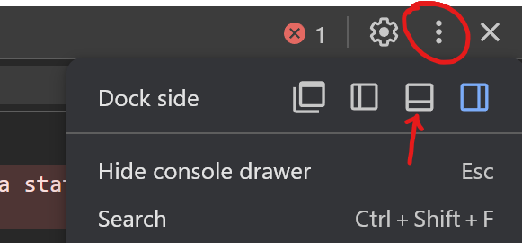

### 2.2 - Variables

##### ICS3 - Mr. Brash 🐿️

# 📝 Your Task:

(Read carefully and work with a partner if you are struggling - ask Mr. Brash only after asking a classmate)

- This repo has been setup already for you with an [HTML page](./index.html) and a [JavaScript code file](./main.js).
- When you preview the HTML page, the JavaScript will run in the background after the page loads.
- Open the developer tools (`CTRL+SHIFT+J` or `Menu > More Tools > Developer Tools`) to see the console.


Some people prefer to have the developer tools at the bottom of the browser window. The options are under the kabob menu.


<br>

---

##### Part 1

1. Create a variable `length` and set it equal to 10
2. Create a variable `width` and set it equal to 5
3. Calculate the area of a rectangle using `length` and `width` - store the answer in a new variable `area`
<br>
(Note: to multiply, use the 'asterisk' `*`) **Example:**
```JS
let x = 3;
let multiplied_value = x * 4;   // This would be 12
```
4. Output the value of the `area` variable to the console.
5. Output the area again, but this time like this: `Area: 50`  {use the `area` variable for the number}

##### Part 2

1. Create a variable called `first_name` and set the value to "Santa".
2. Create a variable called `last_name` and set the value to "Claws".
3. On the next code line, set the value of `last_name` to "Claus".
4. Using the _variables_ you made in 1 and 2, print "I still believe in Santa Claus." to the console.

##### Part 3

There is a way to print out the _type_ of a variable (just in case you needed to check). The keyword is `typeof` and it works like this:
```JS
console.log(typeof side_length)
```

- Have JavaScript print out the _type_ of your `area` and `last_name` variables.

##### Part 4

_Variables_ are called that because they can change. But what if you don't want the variable to change - even by accident? Most programming languages have a special type of variable called a `constant`. These can be used for math and output, but they cannot be adjusted. The keyword for a _constant_ in JavaScript is `const`. Example:
```js
const e = 2.71828
```
1. Create a constant to represent π (3.14).
2. Create a variable for the _radius_ of a circle.
3. Calculate and output the area of the circle using your π constant and _radius_ variable.

<br>

---

<br>

🕒 If you finish with class time left, you can do independent learning.
